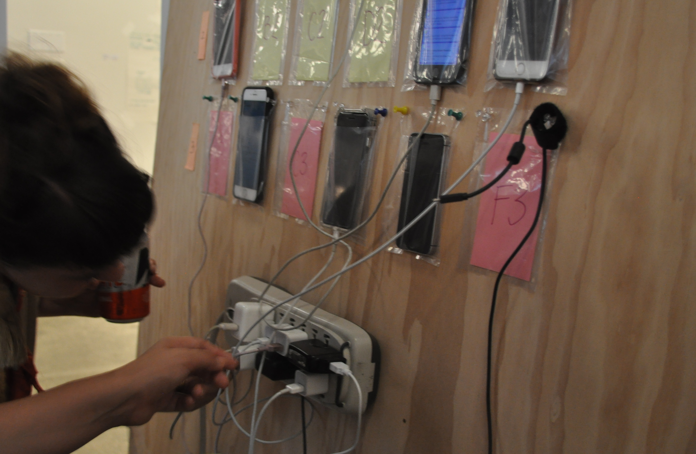

# cell phone wall
a project by Jenny Nelson and K. Kovacs
made for lauren mccarthy's [smarter home](https://github.com/lmccart/Smarter-Home) class as part of [sfpc code societies 2018](https://github.com/SFPC/codesocieties)
 
installed at [code societies student showcase](https://www.eventbrite.com/e/sfpc-code-societies-student-showcase-tickets-47922711119#)  at [prime produce](http://primeproduce.coop/), nyc, july 2018.

# installation at prime produce:

 

 

 

 

 

 

# prototype at sfpc

